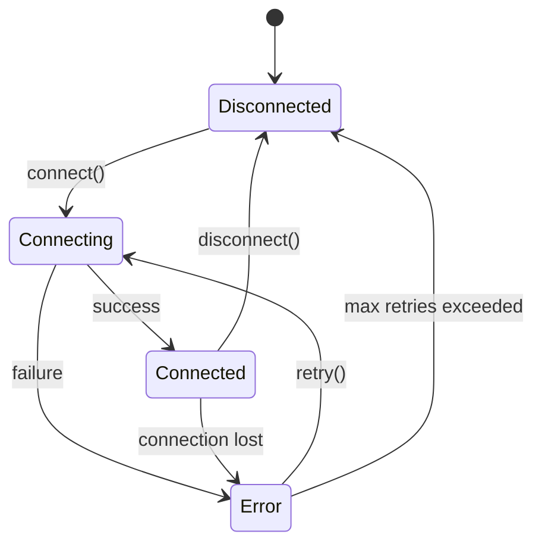

# opencode-ssh-mcp 详细架构设计

## 1. 架构概述

### 1.1 整体架构

```
┌─────────────────┐    ┌──────────────────┐    ┌─────────────────┐
│   opencode      │◄──►│  MCP Server      │◄──►│  SSH Manager    │
│                 │    │  (Go binary)     │    │  (Core Logic)   │
└─────────────────┘    └──────────────────┘    └────────┬────────┘
                                                          │
                                        ┌──────────────────┼──────────────────┐
                                        │                  │                  │
                                ┌───────▼───────┐  ┌───────▼───────┐  ┌───────▼───────┐
                                │  SSH Session  │  │  SSH Session  │  │  SSH Session  │
                                │   (Host A)    │  │   (Host B)    │  │   (Host C)    │
                                └───────┬───────┘  └───────┬───────┘  └───────┬───────┘
                                        │                  │                  │
                                ┌───────▼───────┐  ┌───────▼───────┐  ┌───────▼───────┐
                                │ Remote Host A │  │ Remote Host B │  │ Remote Host C │
                                └───────────────┘  └───────────────┘  └───────────────┘
```

### 1.2 核心组件职责

| 组件 | 职责 | 技术要求 |
|------|------|----------|
| **MCP Server** | 协议转换层，处理 opencode 的 MCP 请求 | 实现标准 JSON-RPC 2.0 协议 |
| **SSH Manager** | 连接池管理，会话生命周期管理 | 线程安全，连接复用 |
| **SSH Config Parser** | 解析 SSH 配置文件 | 支持 OpenSSH 格式 |
| **SSH Session** | 单个 SSH 连接封装 | 自动重连，心跳检测 |
| **Command Executor** | 命令执行和结果解析 | 超时控制，流处理 |

## 2. 详细设计

### 2.1 SSH Config 解析设计

#### 2.1.1 配置文件路径

- 主配置文件: `~/.ssh/config`
- 扩展配置目录: `~/.ssh/config.d/*.conf`
- 搜索顺序: 先主配置，再按字母顺序加载扩展配置

#### 2.1.2 配置解析策略

使用 Go 标准库解析 OpenSSH 配置格式，支持以下字段：
- Host
- HostName  
- Port
- User
- IdentityFile
- ProxyJump

### 2.2 SSH 连接管理设计

#### 2.2.1 连接池设计

- **连接池大小**: 动态调整，最大 10 个并发连接
- **连接复用**: 相同主机的连接可复用（基于 host alias + user）
- **空闲超时**: 30 分钟无活动自动断开
- **健康检查**: 定期发送 keepalive 包

#### 2.2.2 会话状态机



#### 2.2.3 重试策略

- **重试次数**: 默认 3 次
- **重试间隔**: 指数退避 (1s, 2s, 4s)
- **重试条件**: 网络错误、认证失败（非权限错误）

### 2.3 ProxyJump (多跳 SSH) 设计

#### 2.3.1 连接链构建

```
Client → Jump Host 1 → Jump Host 2 → Target Host
```

#### 2.3.2 实现策略

- **递归连接**: 从最内层开始建立连接
- **隧道转发**: 使用 SSH 的 LocalForward 功能
- **资源管理**: 所有中间连接需要正确关闭

### 2.4 MCP 协议集成设计

#### 2.4.1 工具定义

| 工具名称 | 参数 | 返回值 | 说明 |
|---------|------|--------|------|
| `ssh_list` | {} | {hosts: HostInfo[]} | 列出所有可用主机 |
| `ssh_connect` | {host: string} | {session_id: string, status: string} | 连接到指定主机 |
| `ssh_exec` | {session_id: string, command: string} | {stdout: string, stderr: string, exit_code: number} | 在指定会话执行命令 |
| `ssh_status` | {} | {sessions: SessionInfo[]} | 查看所有会话状态 |
| `ssh_disconnect` | {session_id: string} | {success: boolean} | 断开指定会话 |

#### 2.4.2 会话标识策略

- **会话 ID 生成**: `${host_alias}-${timestamp}-${random}`
- **会话查找**: 支持通过 host alias 或 session ID 查找
- **默认会话**: 最近活跃的会话作为默认

### 2.5 错误处理设计

#### 2.5.1 错误分类

| 错误类型 | 处理策略 | 用户提示 |
|---------|----------|----------|
| 网络错误 | 自动重试 3 次 | "网络连接失败，正在重试..." |
| 认证错误 | 不重试，直接报错 | "SSH 认证失败，请检查密钥" |
| 权限错误 | 不重试，直接报错 | "权限不足，无法执行操作" |
| 超时错误 | 重试 1 次 | "操作超时，正在重试..." |

#### 2.5.2 错误信息标准化

```go
type SSHError struct {
	Code     string // SSH_AUTH_FAILED, NETWORK_ERROR, etc.
	Message  string
	Retryable bool
	Host     string
	Command  string
}
```

## 3. 实现路线图

### Phase 1: 基础功能 (Week 1)

- [x] 项目初始化和基础架构
- [x] SSH Config 解析器（支持主配置 + 扩展配置）
- [x] 基础 SSH 连接管理（单连接）
- [x] 基础命令执行（exec 方式，非交互式）
- [x] MCP Server 基础框架

### Phase 2: 核心功能 (Week 2)

- [x] 多连接管理（连接池）
- [x] 自动重试机制（3 次，指数退避）
- [x] 会话状态管理
- [x] 完整的 MCP 工具集
- [x] opencode 集成测试

### Phase 3: 高级功能 (Week 3)

- [x] ProxyJump 支持（多跳 SSH）
- [x] 交互式 Shell 支持
- [x] SFTP 文件传输
- [x] 连接健康检查和自动恢复
- [x] 性能优化和内存管理

### Phase 4: 稳定性 (Week 4)

- [x] 完整测试覆盖
- [x] 错误处理完善
- [x] 文档和示例
- [x] 发布准备

## 4. 技术风险评估

### 4.1 高风险项

| 风险 | 影响 | 缓解措施 |
|------|------|----------|
| SSH 库稳定性 | 可能出现连接泄漏 | 严格的资源管理，超时控制 |
| ProxyJump 复复性 | 多跳连接容易失败 | 分阶段实现，充分测试 |
| 内存泄漏 | 长时间运行可能内存增长 | 连接池限制，定期清理 |

### 4.2 中风险项

| 风险 | 影响 | 缓解措施 |
|------|------|----------|
| SSH Config 兼容性 | 不同 OpenSSH 版本差异 | 充分测试各种配置格式 |
| 命令执行超时 | 长时间运行命令阻塞 | 异步执行，超时中断 |

### 4.3 低风险项

| 风险 | 影响 | 缓解措施 |
|------|------|----------|
| Go 运行时兼容性 | 极低风险 | 使用标准库 |

## 5. 测试策略

### 5.1 单元测试

- SSH Config 解析器
- 连接管理逻辑
- 命令执行逻辑
- 错误处理

### 5.2 集成测试

- 与真实 SSH 服务器连接
- 多主机切换场景
- ProxyJump 场景
- opencode 集成测试

### 5.3 性能测试

- 并发连接压力测试
- 长时间运行稳定性
- 内存使用监控

## 6. 部署和使用

### 6.1 部署方式

- **本地编译**: `go build -ldflags="-s -w" -o opencode-ssh-mcp`
- **预编译二进制**: 提供 Linux/WSL2 二进制下载
- **源码编译**: `git clone && go build`

### 6.2 opencode 配置

```json
{
  "mcpServers": {
    "ssh-manager": {
      "type": "local",
      "command": "/path/to/opencode-ssh-mcp",
      "args": []
    }
  }
}
```

### 6.3 使用示例

```bash
# 在 opencode 中
> ssh list
Available hosts:
  - example-server
  - test-server

> ssh connect example-server
Connected to example-server

> df -h
Filesystem      Size  Used Avail Use% Mounted on
...
```